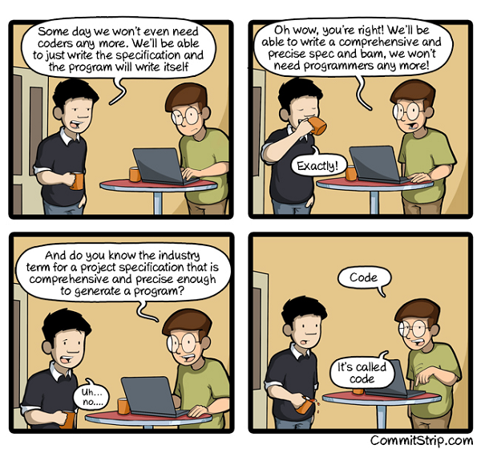

# Awesome No Code

A collection about awesome no code - Why code? Let's go shopping! Let's buy programs & processes & agile methodologies. All about the Chief Digital Officer's (CDO) clicky-clicky-clicky dream future. No code. No text. No numbers. Goodbye, code monkeys! Hello, business architects!

## No Code 

- [**No Code (Classic Open Source Version, Free Download)**](https://github.com/kelseyhightower/nocode) ★19 551 by Kelsey Hightower -- No code is the best way to write secure and reliable applications. Write nothing; deploy nowhere; 1 792 open issues, 297 open pull requests.

- [**No Code Compiler**](https://github.com/tahnik/nocode-compiler) by Tahnik Mustasin -- The perfect no code compiler that compiles nothing to all platforms. Enjoy fast, native application performance at no cost.

- [**No Code Blockchain - OhChain**](https://github.com/sjwaight/ohchain) by Simon Waight -- The first blockchain machinery based on the no code framework. If you'd like to run an initial coin offering (ICO) based on no code tech please let us know!

- [**No Code Cluster - The Hard Way**](https://github.com/fdegir/nocode-the-hard-way) by Fatih Degirmenci -- Step-by-step tutorial that walks you through setting up a no code cluster the hard way.

## No Code Trivia Quiz

### Q: What's the name for someone who can't read & write?

- (A) Chief Alphabet Officer
- (B) Illiterate Know-All / Know-Nothing
- (C) No Alphabet Creative
- (D) Other - Please Tell 

### Q: What's the name for someone who can't read & write code?

- (A) Chief Digital Officer
- (B) Certified No Code Business Architect®
- (C) Pega Marketing Bullshitter
- (D) Other - Please Tell

(Source: [CommitStrip, A very comprehensive and precise spec](http://www.commitstrip.com/en/2016/08/25/a-very-comprehensive-and-precise-spec/), August 25th, 2016)

## Real-World Case Studies

### Pega

> On speed to development, Pega allows us to build no code things once, 
> build them quickly. We're seeing gains of 70, 80, 90 percent.
>
> -- Jimmy Smith, Chief Digital Officer (CDO)

The time has come to abandon slow, expensive, 
and ineffective code-based development. 
Break down the walls to innovation. 
Increase productivity and let Certified Pega No Code Business Architect® professionals design applications with no-code, 
cloud-based visual clicky-clicky-clicky tools - and have the Pega platform do the coding for you.

Breaking the shackles of code delivers immediate results. 
You build and change applications faster. 
You expand into new channels like mobile and chatbots and launch new products at will. 
You innovate and leap-frog competition while delivering extraordinary value to your business.

Once you get code out of the way, the possibilities are limitless.

When software is built with code, 
only people who can read and write can build software. 
Pega's visual models let Certified Pega No Code Business Architect® professionals – marketers, 
sellers, customer experience leaders, 
operations experts - build the software they need 
and drive productivity across the business. 
Need to process a new type of work? 
Draw the case lifecycle. 
Want to do 1:1 marketing? Design your decision strategies.

Beyond Future-Proof - Future Empowered.

Technology comes at you fast. That funky Javascript library your customer experience guy told you about? Already outdated. The mobile app you rolled last year? Ancient.

When you code applications, you take on the heavy lifting of keeping them up to date. Want to use the latest HTML templating? Recode the app. Want to increase performance with a new caching layer? Recode the app.

Design your application instead with no code! 

(Source: [Go Code Free with Pega - The Power of Marketing Bullshit](https://www.pega.com/technology/software-writes-your-software))

Start your no code subscription today. Starting at €€€ 20 000 per employee/year. It's a steal!
Get locked-in with no code! Say no! no! no! to free open (source) code, languages, scripts & formats. 

## Don't Do Bad Practices Videos

- [**One Hacker Way (A Rational Alternative for "Agile")**](https://www.youtube.com/watch?v=2u0sNRO-QKQ) by Erik Meijer -- Code, Code, Code
- [**One Hacker Way (Cont.)**](https://www.youtube.com/watch?v=FvMuPtuvP5w) by Erik Meijer @ GOTO 2015 Conference -- Code, Code, Code 

## Meta

**License**

The awesome list is dedicated to the public domain. Use it as you please with no restrictions whatsoever.
